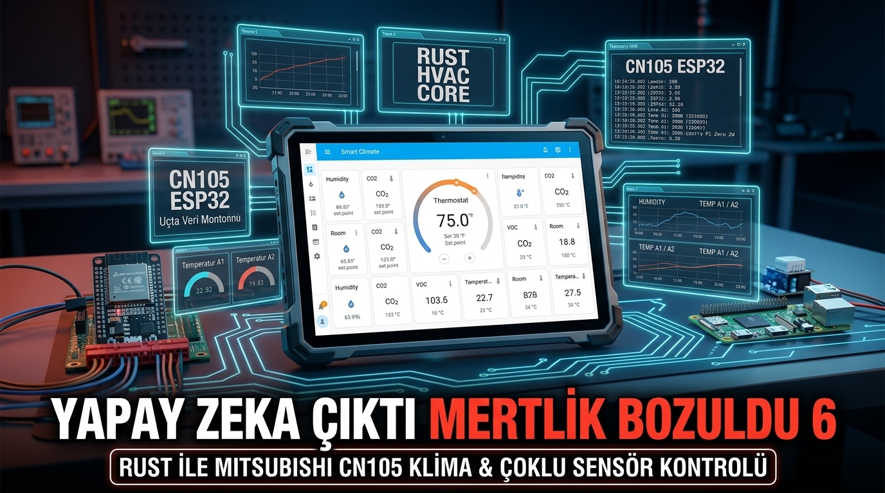
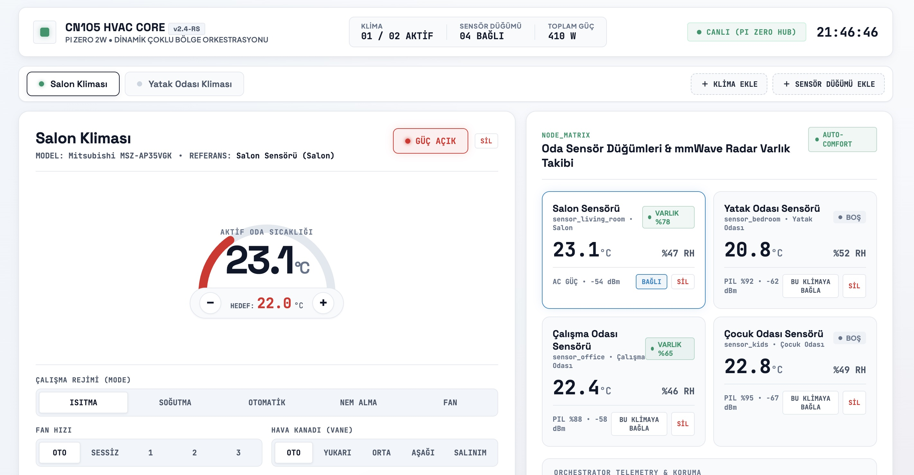
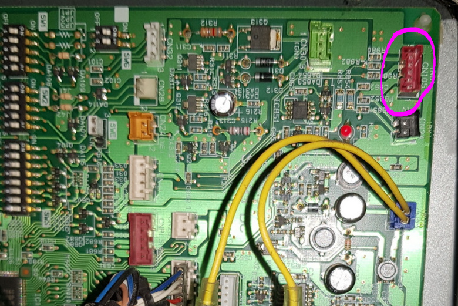
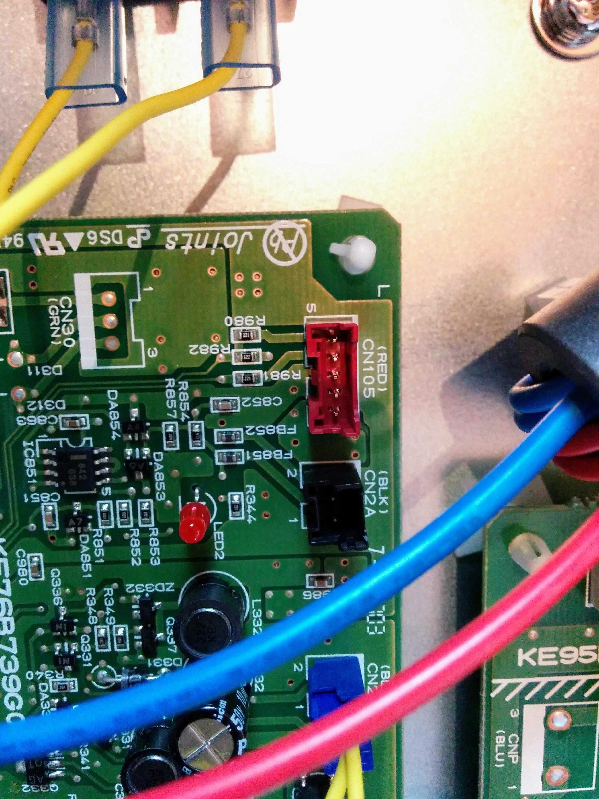
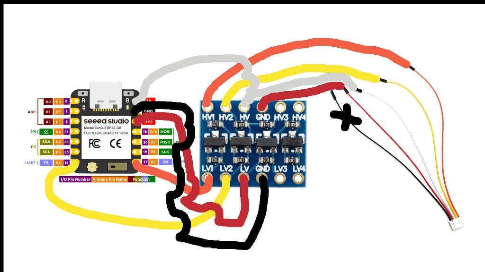

# ❄️ Mitsubishi Electric CN105 — Yüksek Performanslı Rust Tabanlı İklimlendirme ve Akıllı Ev Sistemi

Bu proje; **Mitsubishi Electric** split/multi-split klima iç ünitelerinde bulunan kırmızı **CN105** haberleşme portunu doğrudan kullanarak, klimaları kapalı bulut sistemlerine (MelCloud vb.) ya da kaynak tüketen harici platformlara bağımlı kalmadan; **%100 Rust** ile yazılmış gömülü ve merkezi yazılımlarla yerel ağ üzerinden kontrol eden, dinamik oda sensörleriyle otonom iklimlendirme sağlayan kurumsal bir IoT çözümüdür.

Sistem; klimaya bağlı **ESP32** düğümleri, odalara yerleştirilen çoklu **ortam/varlık sensörleri** ve merkezi **Raspberry Pi Zero 2 W** üzerinde koşan ultra hafif bir yönetim motoru ile **modern tablet dashboard**'undan oluşur.

---

## 📸 Sistem Ekran ve Donanım Görselleri

### 1. Kurumsal Tablet Dashboard Arayüzü
*Sistemde koşan gerçek zamanlı dinamik tablet arayüzü; dinamik olarak bağlanan klimaları, odaların sıcaklık/nem durumlarını ve mmWave radar varlık algılamasını anlık olarak görselleştirir.*



---

### 2. Mitsubishi Anakart ve Kırmızı CN105 Portu
*Mitsubishi Electric iç ünite anakartı üzerinde yer alan 5 pinli kırmızı CN105 konnektörü.*

| Anakart Konumu (CN105) | CN105 5-Pin Konnektör Yakın Çekim |
| :---: | :---: |
|  |  |

---

### 3. ESP32 & Mantıksal Seviye Dönüştürücü (Logic Level Shifter) Devre Şeması
*Klima anakartı 5V mantık seviyesi (TTL) ile haberleşirken, ESP32 GPIO pinleri 3.3V toleranslıdır. Donanım güvenliği için çift yönlü (bi-directional) I2C/UART seviye dönüştürücü kullanımı zorunludur.*



---

## ⚡ Neden Rust? ESPHome ve C++'a Karşı Üstünlükleri

Eski çözümler genel olarak Arduino C++ kütüphaneleri veya ESPHome çatısı üzerine kuruludur. Ancak gerçek saha koşullarında kesintisiz 7/24 çalışma, bellek kısıtlı cihazlar (Pi Zero 2 W) ve çoklu klima orkestrasyonu söz konusu olduğunda C++ tabanlı çözümler ciddi handikaplar barındırır. Bu projede **Rust** tercih edilmesinin temel teknik nedenleri şunlardır:

### 1. Bellek Güvenliği ve Sıfır Maliyetli Soyutlama (Zero-Cost Abstractions)
* **C++ Problemi:** Ham işaretçiler (raw pointers), arabellek taşmaları (buffer overflow) ve serbest bırakılan belleğe erişim (use-after-free) gibi hatalar, UART üzerinden gelen bozuk paketlerde cihazların kilitlenmesine ve watchdog resetlerine sebep olur.
* **Rust Çözümü:** Rust'ın mülkiyet (ownership) ve ödünç alma (borrowing) mekanizması sayesinde derleme aşamasında tüm bellek güvenliği garanti edilir. `malloc`/`free` kaynaklı sızıntılar sıfıra indirgenir.

### 2. Veri Yarışmalarının (Data Race) İmkansız Kılınması
* Klima kontrolünde seri port okuma döngüsü, Wi-Fi telemetrisi, MQTT/HTTP istekleri ve sensör veri akışları eş zamanlı yürütülür.
* Rust'ın `Send` ve `Sync` trait'leri sayesinde thread'ler veya async task'lar arasında paylaşılan durumlar (`Arc<RwLock<T>>`) donanım seviyesinde kilitlenme veya senkronizasyon hatası oluşturmadan güvenle koşturulur.

### 3. ESPHome Döngü Bloklamalarının (Loop Blocking) Ortadan Kaldırılması
* ESPHome tek bir `loop()` zinciri üzerinde çalışır. Klimanın CN105 portundan yanıt beklenirken yaşanan mikrosaniyelik gecikmeler sensör okumalarını ve web arayüzünü dondurabilir.
* Rust tarafında `tokio` (merkez sunucu) ve `esp-idf-hal` / async döngüler donanım kesmelerini non-blocking mimaride işler; UART hatasız 2400 baud zamanlamasıyla kesintisiz akar.

### 4. Raspberry Pi Zero 2 W İçin Ultra Düşük Kaynak Tüketimi
* Python, Node.js veya ağır Home Assistant container'ları Pi Zero 2 W'nin 512 MB RAM kapasitesini hızla tüketir, swap alanı yaratır ve SD kartı aşındırır.
* Rust ile derlenen **`core-hub`** ikili dosyası (binary), tüm web dashboard arayüzü içine gömülü (`rust-embed`) ve SQLite veritabanı aktifken dahi **15 MB'tan az RAM** tüketir, CPU kullanımı %1 seviyesindedir.

---

## 🔌 Donanım Bağlantısı ve CN105 Pin Şeması

CN105 konnektörü JST-PA 2.0mm 5-pin soket yapısındadır.

| Pin No | Sinyal Adı | Seviye | Açıklama |
| :---: | :---: | :---: | :--- |
| **Pin 1** | **12V / 5V** | DC Besleme | Model ailesine göre 12V veya 5V besleme (ESP32 için harici regülatör önerilir). |
| **Pin 2** | **GND** | 0V | Ortak toprak hattı (ESP32 GND ve Dönüştürücü GND hattına bağlanır). |
| **Pin 3** | **5V (VCC)** | 5V DC | Lojik seviye dönüştürücünün yüksek voltaj (HV) tarafını besler. |
| **Pin 4** | **TXD** | 5V TTL | Klimadan çıkan veri hattı (Level Shifter üzerinden ESP32 RX pinine). |
| **Pin 5** | **RXD** | 5V TTL | Klimaya giden veri hattı (Level Shifter üzerinden ESP32 TX pinine). |

> ⚠️ **UYARI:** ESP32 pinlerine doğrudan 5V UART sinyali uygulamayınız! Mutlaka şemadaki gibi **3.3V <-> 5V Bi-directional Logic Level Shifter** kullanınız.

---

## 🏛️ Proje Mimarisi ve Rust Crate Yapısı

Proje modüler bir Cargo çalışma alanı (workspace) olarak inşa edilmiştir:

```
├── Cargo.toml                    # Çalışma alanı (Workspace) tanımı
├── crates/
│   ├── cn105-proto/              # Saf (Pure) Rust CN105 protokol motoru
│   │   ├── src/
│   │   │   ├── types.rs          # Mod, Fan, Kanat, Sıcaklık veri tipleri
│   │   │   ├── packet.rs         # Paket çözücü, inşa edici ve Checksum
│   │   │   └── lib.rs            # Birim testleri ve API ihracı
│   ├── hvac-esp32/               # ESP32 Klima Kontrol Firmware'i
│   │   └── src/main.rs           # UART 2400 baud döngüsü ve HTTP/REST istemcisi
│   ├── sensor-esp32/             # ESP32 Çoklu Oda Sensör Firmware'i
│   │   └── src/main.rs           # SHTC3 sıcaklık/nem & LD2410 mmWave varlık radarı
│   └── core-hub/                 # Pi Zero 2W Merkezi Yönetim Sunucusu
│       └── src/
│           ├── main.rs           # Tokio + Axum REST API sunucusu
│           ├── storage.rs        # SQLite asenkron durum kalıcılığı
│           └── static_files.rs   # Web Dashboard statik asset gömme mekanizması
├── ui/                           # Bağımsız ve Gömülü Web/Tablet Arayüzü
│   ├── index.html                # Semantik HTML5 mimarisi
│   ├── style.css                 # Açık tema, endüstriyel kurumsal CSS
│   └── app.js                    # Dinamik klima/sensör yönetim motoru
├── docs/                         # Devre şemaları
│   └── cn105-esp32-level-shifter.jpg
└── hero_banner.jpg               # "YAPAY ZEKA ÇIKTI MERTLİK BOZULDU 6"
```

### 1. `cn105-proto` (Saf Protokol Kütüphanesi)
* `no_std` uyumlu saf Rust mimarisi.
* **Protokol:** 2400 Baud, 8 Data Bits, Even Parity, 1 Stop Bit (8E1).
* **Checksum Hesabı:** Tüm baytların toplamı modulo 256 yapılarak `0xfc - sum` formülüyle doğrulanır.
* **Sıcaklık Kodlaması:** Hem eski Mitsubishi (Encoding A: `temp - 10`) hem de modern hassas 0.5°C adımlı (Encoding B: `(temp * 2) - 128` formatı) otomatik olarak desteklenir.

### 2. `hvac-esp32` (Klima Düğümü)
* ESP32 üzerinde koşarak UART üzerinden periyodik `0x42` (durum sorgu) paketleri gönderir.
* Kullanıcı ayar yaptığında `0x41` (ayar paketi) oluşturarak klima kanat açısı, fan hızı, hedef sıcaklık ve çalışma modunu anında iletir.
* Wi-Fi üzerinden `core-hub` ile sürekli durum senkronizasyonu sağlar.

### 3. `sensor-esp32` (Oda Sensör Düğümü)
* Odalara yerleştirilen kompakt ESP32 modülleri; SHTC3/AHT20 ile hassas sıcaklık ve nem ölçümü yapar.
* LD2410 24GHz mmWave radar ile odadaki en ufak hareketi (nefes alma, hareketsiz oturma dahil) tespit ederek "Varlık Algılandı" bilgisi üretir.
* Bu veriler merkezi hub'a iletilerek odada kimse yokken klimanın otomatik tasarruf moduna geçmesi sağlanır.

### 4. `core-hub` (Merkezi Orkestratör & Sunucu)
* **Axum + Tokio:** Yüksek verimli asenkron HTTP REST API.
* **SQLite:** Tarihsel telemetri ve cihaz ayarlarını güvenli biçimde diskte saklar.
* **Dinamik Cihaz Mimarisi:** Sisteme yeni bir klima veya sensör eklendiğinde kod derlemeye gerek kalmadan otomatik tanınır ve arayüze eklenir.

---

## 🚀 Kurulum ve Çalıştırma

### Gereksinimler
* Rust 1.75+ (`curl --proto '=https' --tlsv1.2 -sSf https://sh.rustup.rs | sh`)

### 1. Testlerin Koşturulması
Protokol motorundaki tüm checksum, paket ayrıştırma ve sıcaklık kodlama testlerini doğrulamak için:
```bash
cargo test --workspace
```

### 2. Core-Hub Sunucusunun Başlatılması
Geliştirme veya sunucu ortamında çalıştırmak için:
```bash
cargo run -p core-hub
```
Sunucu başlatıldığında terminalde şu çıktı görüntülenir:
```
INFO  core_hub: Core-Hub başlatılıyor... (Pi Zero 2W Optimize)
INFO  core_hub: SQLite veritabanı hazırlandı: history.db
INFO  core_hub: HTTP Dashboard sunucusu dinlemede: http://0.0.0.0:8080
```
Herhangi bir web tarayıcısından ya da duvara monte tabletten `http://<IP-ADRESI>:8080` adresine girerek kontrol paneline erişebilirsiniz.

### 3. REST API Uç Noktaları

| Yöntem | Uç Nokta | Açıklama |
| :---: | :--- | :--- |
| `GET` | `/api/hvac` | Sistemde kayıtlı tüm klimaları ve anlık durumlarını listeler. |
| `GET` | `/api/sensors` | Odalardaki tüm sıcaklık/nem/varlık sensör verilerini döner. |
| `POST` | `/api/hvac/:id/set` | Belirtilen klimanın mod, fan, kanat ve sıcaklık ayarlarını günceller. |
| `POST` | `/api/hvac` | Sisteme dinamik olarak yeni bir klima cihazı kaydeder. |
| `POST` | `/api/sensors` | Sisteme yeni bir sensör düğümü kaydeder. |

---

---

## 📜 Lisanslama ve Hukuki Şartlar (Dual License / PolyForm Noncommercial 1.0.0)

Bu proje, açık kaynak dünyasında ve kurumsal yazılım sektöründe kabul görmüş **Çift Lisanslama (Dual-Licensing / PolyForm Model)** standardı altında sunulmaktadır:

| Kullanım Alanı | Uygulanan Lisans Standartı | Ücret / Şart |
| :--- | :--- | :--- |
| **🏠 Bireysel & Ev Otomasyonu** | **PolyForm Noncommercial 1.0.0** (`SPDX: PolyForm-Noncommercial-1.0.0`) | **ÜCRETSİZ** |
| **🎓 Üniversite, Eğitim & Akademi** | **PolyForm Noncommercial 1.0.0** (`SPDX: PolyForm-Noncommercial-1.0.0`) | **ÜCRETSİZ** |
| **💼 Ticari, Kurumsal & Gelir Getirici** | **ARIOT Ticari / Kurumsal Lisans (Commercial License)** | **ÜCRETE TABİDİR** |

### 1. Ücretsiz Kullanım Kapsamı (PolyForm Noncommercial 1.0.0)
Kişisel evinizde klimanızı kontrol etmek, hobi projeleri geliştirmek, üniversiteler, akademisyenler, öğrenciler ve kâr amacı gütmeyen eğitim kurumları tarafından eğitim/araştırma faaliyetlerinde bulunmak amacıyla **tamamen ücretsiz, bedelsiz ve özgürce** kullanılabilir.

### 2. Ticari ve Kurumsal Kullanım (Ticari Lisans Zorunluluğu)
Doğrudan veya dolaylı ticari kazanç sağlama amacıyla; otellerde, ticari binalarda, plazalarda kullanım, müşterilere ücret karşılığı anahtar teslim kurulum/otomasyon hizmeti sunulması, ticari bir donanım/cihaz içerisine gömülerek satılması veya SaaS/bulut hizmeti olarak pazarlanması durumunda **önceden yazılı Ticari Lisans alınması ve lisans bedelinin ödenmesi yasal bir zorunluluktur.**

> 📄 Tam hukuki lisans metni için depodaki [LICENSE](LICENSE) dosyasını inceleyiniz.

**Ticari Lisanslama, B2B Entegrasyon ve İletişim:**
* **Telif Sahibi:** Rıfat Şeker (ARIOT)
* **Web Sitesi:** [ariot.com.tr](https://ariot.com.tr)
* **E-posta:** info@ariot.com.tr
* **GitHub:** [@rifatsekerariot](https://github.com/rifatsekerariot)


